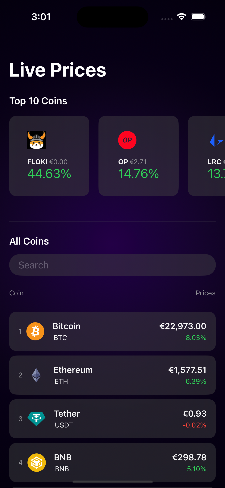
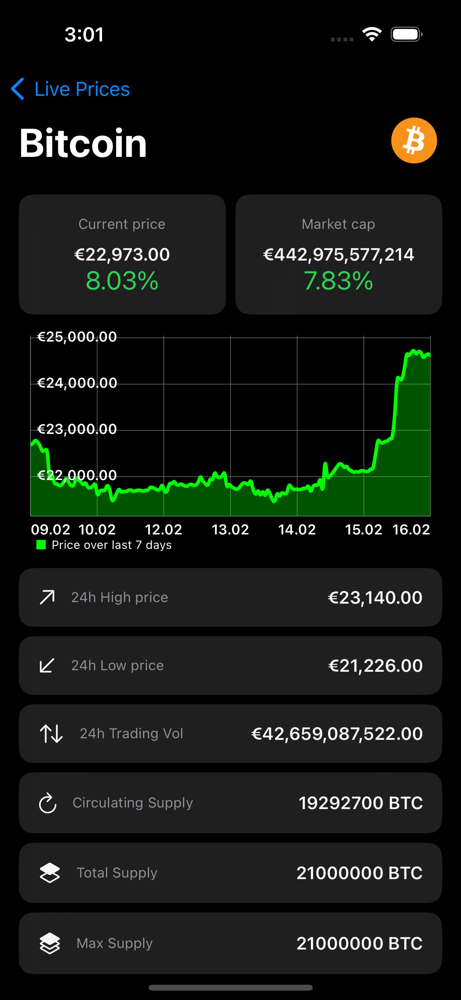
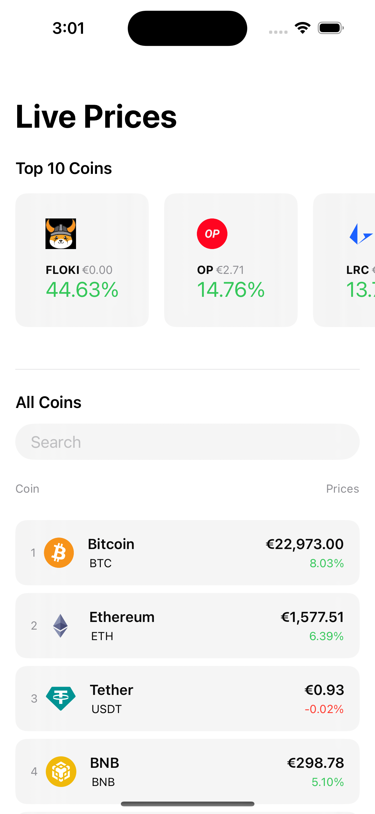
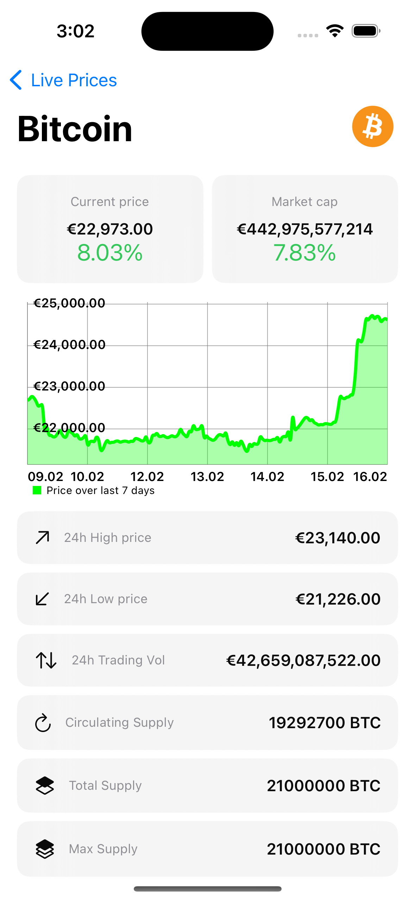

# CryptoStatus-SwiftUI

In this SwiftUI project, I developed a simple crypto tracking app using:
- MVVM
- CoinGecko API - https://www.coingecko.com/en/api
- Alamofire
- Realm
- Kingfisher
- Charts

<h3>Video</h3>

https://user-images.githubusercontent.com/61547580/219388159-b6ff92e8-9311-472f-af12-c96318751feb.mp4

